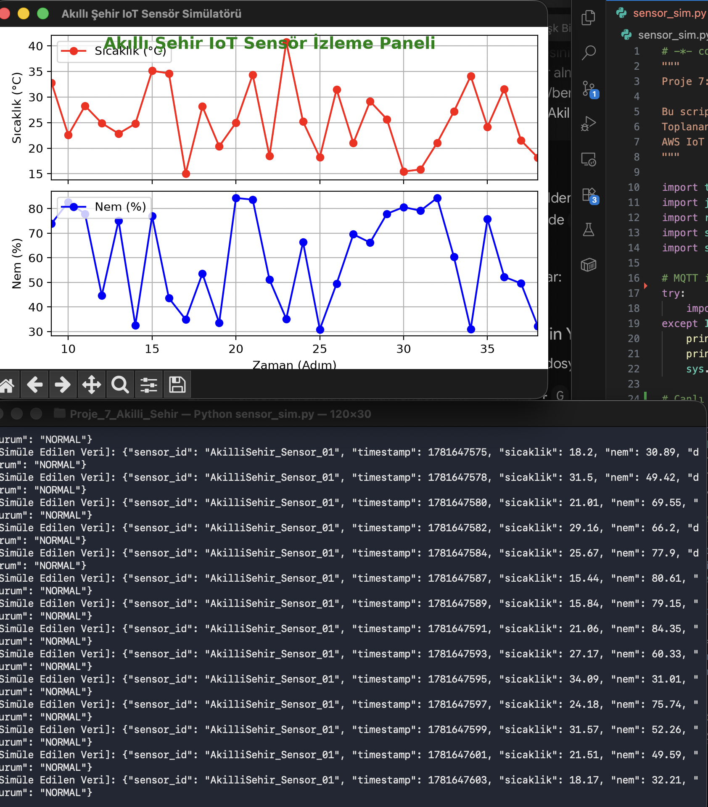

# Proje 7: IoT ve Akıllı Şehir Uygulaması - AWS Kurulum Rehberi

Bu rehber, akıllı şehir çevre sensörü simülatöründen gelen MQTT verilerinin AWS IoT Core üzerinde karşılanıp AWS Lambda fonksiyonuna yönlendirilmesi için gereken AWS Management Console adımlarını içermektedir.

---

## 1. BÖLÜM: AWS IoT Core Kurulumu

AWS IoT Core, cihazların buluta güvenli bir şekilde bağlanmasını ve veri göndermesini sağlar.

### Adım 1.1: Thing (Nesne/Cihaz) Oluşturma
1. AWS Console'da **IoT Core** hizmetine gidin.
2. Sol menüden **Manage** (Yönet) -> **All devices** -> **Things** (Nesneler) seçeneğine tıklayın.
3. Sağ üst köşedeki **Create things** (Nesne oluştur) butonuna basın.
4. **Create single thing** (Tek bir nesne oluştur) seçeneğini seçip **Next** deyin.
5. Nesne adı (Thing name) olarak `AkilliSehir_Sensor_01` yazın. Diğer ayarları varsayılan bırakıp **Next** butonuna basın.

### Adım 1.2: Cihaz Sertifikalarını Üretme ve İndirme
AWS IoT Core bağlantıları SSL/TLS sertifikaları gerektirir.
1. Cihaz kimlik doğrulama ekranında (Configure device certificate) **Auto-generate a new certificate (recommended)** seçeneğini işaretleyip **Next** deyin.
2. **Download certificates and keys** (Sertifikaları ve anahtarları indirin) ekranında şu dosyaları indirin:
   - **Device certificate** (Cihaz sertifikası - `.pem.crt` uzantılı)
   - **Private key file** (Özel anahtar - `private.pem.key` uzantılı)
   - **RSA 2048 bit key: Amazon Root CA 1** (Kök sertifika - `AmazonRootCA1.pem` adıyla kaydedin)
3. *Önemli:* Bu dosyaları projenizin kök dizininde `certs/` adında bir klasör oluşturup içine taşıyın ve isimlerini `sensor_sim.py` içindeki tanımlarla eşleştirin.
4. Sayfada **Activate** butonuna tıklayarak sertifikayı etkinleştirin ve ardından **Next** deyin.

### Adım 1.3: IoT Core Politikası (Policy) Oluşturma ve Eşleştirme
Cihazın bağlanıp veri yayınlayabilmesi için yetkilendirilmesi gerekir.
1. Sol menüden **Manage** -> **Security** -> **Policies** (Politikalar) bölümüne gidin.
2. **Create policy** (Politika oluştur) butonuna tıklayın.
3. Politikaya bir ad verin (Örn: `AkilliSehir_Sensor_Policy`).
4. **Policy Document** kısmında JSON sekmesini seçip aşağıdaki izin politikasını yapıştırın:
   ```json
   {
     "Version": "2012-10-17",
     "Statement": [
       {
         "Effect": "Allow",
         "Action": [
           "iot:Connect",
           "iot:Publish"
         ],
         "Resource": [
           "*"
         ]
       }
     ]
   }
   ```
5. **Create** diyerek politikayı oluşturun.
6. Sol menüden **All devices** -> **Things** -> `AkilliSehir_Sensor_01` nesnesine tıklayın.
7. **Certificates** sekmesine gidip oluşturduğunuz sertifikayı seçin.
8. **Actions** -> **Attach policy** (Politika ekle) seçeneğinden oluşturduğunuz `AkilliSehir_Sensor_Policy` politikasını bu sertifikaya bağlayın.

### Adım 1.4: AWS IoT Endpoint Öğrenme
1. AWS IoT Core sol menüsünün en altındaki **Settings** (Ayarlar) sekmesine tıklayın.
2. **Device data endpoint** başlığı altındaki adresi (örn: `a1xxxxxxxxx-ats.iot.eu-west-1.amazonaws.com`) kopyalayın.
3. Bu adresi `sensor_sim.py` dosyasındaki `AWS_ENDPOINT` değişkenine yapıştırın.

---

## 2. BÖLÜM: AWS Lambda Kurulumu

Lambda, sunucusuz mimaride sensörlerden gelen verileri gerçek zamanlı analiz eder.

### Adım 2.1: Lambda Fonksiyonu Oluşturma
1. AWS Console'da **Lambda** hizmetine gidin.
2. **Create function** (Fonksiyon oluştur) butonuna tıklayın.
3. **Author from scratch** seçeneğini işaretleyin.
4. **Function name** kısmına `AkilliSehir_Sensor_Analiz` yazın.
5. **Runtime** (Çalışma zamanı) olarak en güncel **Python** sürümünü seçin.
6. Gelişmiş ayarlara dokunmadan **Create function** butonuna tıklayın.

### Adım 2.2: Kodu Yükleme
1. Fonksiyon oluştuktan sonra gelen kod editörü ekranında `lambda_function.py` dosyasının içeriğini kopyalayıp editöre yapıştırın.
2. Değişikliklerin kaydedilmesi için üstteki **Deploy** butonuna basın.

---

## 3. BÖLÜM: IoT Core Kuralı (Rule) ile Lambda Entegrasyonu

IoT Core'a gelen veriyi Lambda fonksiyonumuza yönlendirmek için bir kural oluşturmamız gerekir.

### Adım 3.1: IoT Rule Tanımlama
1. AWS IoT Core sol menüsünden **Message routing** (Mesaj yönlendirme) -> **Rules** (Kurallar) sekmesine gidin.
2. **Create rule** (Kural oluştur) butonuna tıklayın.
3. Kural adı (Rule name) olarak `SensorVerisiniAnalizEt` yazın ve **Next** deyin.
4. **SQL statement** bölümüne aşağıdaki SQL sorgusunu yazarak gelen tüm verileri seçmesini sağlayın:
   ```sql
   SELECT * FROM 'sehir/sensor/veri'
   ```
5. **Next** butonuna tıklayın.

### Adım 3.2: Eylem (Action) Olarak Lambda Bağlantısı
1. **Rule actions** listesinden **Lambda** seçeneğini seçin.
2. **Lambda function** açılır menüsünden oluşturduğumuz `AkilliSehir_Sensor_Analiz` fonksiyonunu seçin.
3. **Next** diyerek gözden geçirme sayfasına geçin ve **Create** butonuna tıklayarak kuralı oluşturun.

---

## 4. BÖLÜM: Uygulamayı Çalıştırma ve Test

### Adım 4.1: Gerekli Kütüphanelerin Kurulması
Uygulamanın çalışması için `paho-mqtt` ve canlı grafiği çizdiren `matplotlib` kütüphanelerinin yüklü olması gerekir. macOS veya diğer işletim sistemlerinde sistem paket çakışmalarını önlemek için sanal ortam (venv) kullanılması önerilir:

1. Proje dizininde bir sanal ortam oluşturun ve aktif edin:
   ```bash
   python3 -m venv venv
   source venv/bin/activate
   ```
2. Gerekli paketleri kurun:
   ```bash
   pip install paho-mqtt matplotlib
   ```

*(Alternatif olarak, sanal ortam kullanmadan doğrudan yüklemek isterseniz: `python3 -m pip install paho-mqtt matplotlib --break-system-packages` komutunu çalıştırabilirsiniz.)*

### Adım 4.2: Sertifikaların Yerleştirilmesi
1. AWS IoT Core'dan indirdiğiniz 3 adet sertifika dosyasını projenin kök dizininde `certs/` adında bir klasör oluşturarak içine yerleştirin:
   - `AmazonRootCA1.pem` (Kök Sertifika)
   - `device-certificate.pem.crt` (Cihaz Sertifikası)
   - `private.pem.key` (Özel Anahtar)
2. Bu sertifika isimlerinin `sensor_sim.py` içerisindeki `CA_PATH`, `CERT_PATH` ve `KEY_PATH` değişkenleriyle eşleştiğinden emin olun.

### Adım 4.3: Simülatörün ve Canlı İzleme Panelinin Başlatılması
1. Simülatörü çalıştırın:
   ```bash
   python sensor_sim.py
   ```
2. Kod çalıştığında, anlık olarak üretilen sıcaklık ve nem verilerini içeren **"Akıllı Şehir IoT Sensör İzleme Paneli"** canlı grafik penceresi açılacaktır:
   - Grafik her 2 saniyede bir yeni veri noktaları ile güncellenir ve son 30 veri noktasını ekranda tutar.
   - **Görsel Alarm Durumu:** Simüle edilen sıcaklık verisi 35°C kritik eşiğini geçtiğinde, grafik başlığı kırmızı ve kalın bir **"⚠️ KRİTİK EŞİK AŞILDI!"** uyarısına dönüşür ve sıcaklık grafik panelinin arka planı hafif kırmızı renge boyanarak görsel bir alarm tetiklenir. Normal duruma dönüldüğünde grafik eski haline kavuşur.
3. Aynı zamanda AWS IoT Core ve AWS Lambda entegrasyonunuz aktif durumdaysa, veriler AWS tarafına da eş zamanlı olarak gönderilmeye devam edecektir.

### Adım 4.4: Canlı Grafik Arayüzü Ekran Görüntüsü
Aşağıda, uygulamanın terminal çıktısı ve buna bağlı olarak canlı olarak çizilen sıcaklık-nem grafiğinin ekran görüntüsü yer almaktadır:




