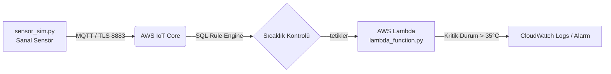

# Bulut Bilişim Dersi - Proje Raporu
## Proje 7: IoT ve Akıllı Şehir Uygulaması

**Öğrenci Bilgileri:**
*   **Adı Soyadı:** [Adınızı Buraya Yazın]
*   **Öğrenci Numarası:** [Numaranızı Buraya Yazın]
*   **Tarih:** 16.06.2026

---

## 1. Giriş ve Projenin Amacı
Bu projenin amacı, akıllı şehir altyapılarında kullanılan IoT cihazlarından gelen verilerin bulut ortamında nasıl işlendiğini ve analiz edildiğini deneyimlemektir. Projede, sanal bir IoT sıcaklık ve nem sensörü simüle edilmiş, bu veriler MQTT (Message Queuing Telemetry Transport) protokolüyle AWS IoT Core servislerine aktarılmış ve sonrasında sunucusuz (Serverless) AWS Lambda fonksiyonu aracılığıyla gerçek zamanlı analiz edilerek alarm mekanizmaları test edilmiştir.

---

## 2. Sistem Mimarisi
Projenin genel mimarisi uçtan uca şu şekildedir:



### Mimari Bileşenler:
1.  **Cihaz Katmanı (sensor_sim.py):** Python ile yazılmış MQTT istemcisidir. Rastgele sıcaklık ve nem verisi üretir ve SSL/TLS sertifikalarını kullanarak AWS IoT Core'a bağlanır.
2.  **Haberleşme Katmanı (MQTT):** Güvenli TLS portu (8883) üzerinden `sehir/sensor/veri` konusu (topic) altında yayın yapar.
3.  **Yönlendirme Katmanı (AWS IoT Core Rules):** Gelen mesajları filtreler ve tetikleyici olarak AWS Lambda fonksiyonuna iletir.
4.  **Bulut İşlem Katmanı (AWS Lambda):** Sunucusuz çalışan ve gelen veriyi işleyip sıcaklık 35 derecenin üzerindeyse alarm üreten analiz kodudur.
5.  **İzleme Katmanı (AWS CloudWatch):** Çalışma loglarını ve alarm durumlarını kaydeder.

---

## 3. Veri Yapısı (JSON Payload)
Sanal sensörden gönderilen ve Lambda tarafından işlenen örnek veri paketi şöyledir:

```json
{
  "sensor_id": "AkilliSehir_Sensor_01",
  "timestamp": 1781619325,
  "sicaklik": 36.4,
  "nem": 55.2,
  "durum": "NORMAL"
}
```

---

## 4. Kod Açıklamaları

### 4.1 Cihaz Simülatörü (`sensor_sim.py`)
*   `paho-mqtt` kütüphanesi kullanılarak bir MQTT istemcisi tanımlanmıştır.
*   AWS IoT Core bağlantısı için karşılıklı kimlik doğrulama (mutual auth) mekanizması `client.tls_set()` metoduyla kurulmuştur.
*   Her 5 saniyede bir `generate_sensor_data()` fonksiyonu ile sıcaklık ve nem üretilip JSON formatında sunucuya yollanmaktadır.
*   Eğer sertifika dosyaları bulunamazsa, kodun kesintiye uğramaması için yerel simülasyon fonksiyonu (`run_local_simulation()`) devreye girmektedir.

### 4.2 Analiz Fonksiyonu (`lambda_function.py`)
*   Lambda tetiklendiğinde `lambda_handler(event, context)` fonksiyonu çağrılır.
*   `event` parametresindeki JSON verisi çözümlenerek `sicaklik` ve `nem` değerleri ayrıştırılır.
*   Eğer `sicaklik > 35` koşulu sağlanırsa, sistem `logger.warning` ile CloudWatch üzerinde alarm uyarısı oluşturur.
*   Analiz sonucu Lambda dönüş değeri (Return) olarak yapılandırılmış bir JSON sözlüğü ile AWS ortamına raporlanır.

---

## 5. Uygulama Sonuçları ve Ekran Görüntüleri
*Yerel simülasyon çıktısı:*
```text
Bağlanılıyor: YOUR_AWS_IOT_ENDPOINT.iot.eu-west-1.amazonaws.com (Port: 8883)...
⚠️ Sertifika dosyası bulunamadı: certs/AmazonRootCA1.pem
AWS IoT Core'a bağlanmadan önce 'certs/' klasörüne sertifikalarınızı yerleştirmelisiniz.
Şimdilik kodun hata vermeden simülasyon çıktısı üretmesi için devam ediliyor...

--- YEREL SİMÜLASYON MODU (AWS Bağlantısı Yok) ---
[Simüle Edilen Veri]: {"sensor_id": "AkilliSehir_Sensor_01", "timestamp": 1781619325, "sicaklik": 23.45, "nem": 62.12, "durum": "NORMAL"}
[Simüle Edilen Veri]: {"sensor_id": "AkilliSehir_Sensor_01", "timestamp": 1781619330, "sicaklik": 36.12, "nem": 45.89, "durum": "NORMAL"}
🚨 UYARI: Sıcaklık kritik seviyede! (>35°C)
```

*(Bu alana AWS Management Console üzerinde başarılı bağlantı yapıldığında ve Lambda CloudWatch loglarında oluşturulan alarmları gösteren ekran görüntülerinizi ekleyebilirsiniz.)*

---

## 6. Değerlendirme ve Kazanımlar
Bu projeyle birlikte:
*   MQTT protokolünün IoT dünyasındaki önemi ve hafif yapısı öğrenilmiştir.
*   AWS IoT Core sertifika ve güvenlik kuralları (X.509 sertifikaları, AWS Policies) uygulamalı olarak anlaşılmıştır.
*   AWS Lambda ile event-driven (olay güdümlü) sunucusuz programlama yapılmış, bulut bilişimin ölçeklenebilirlik avantajları gözlemlenmiştir.
